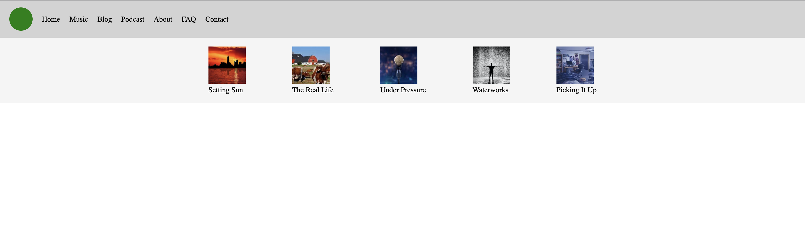
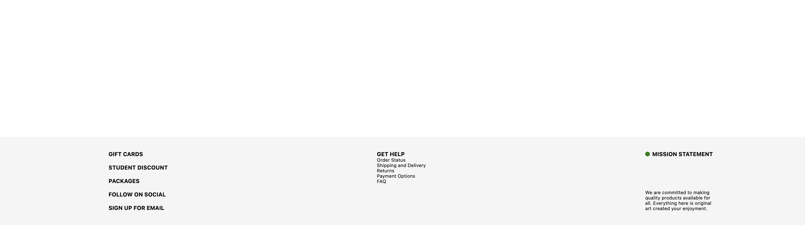
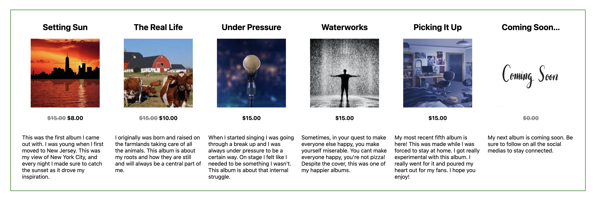
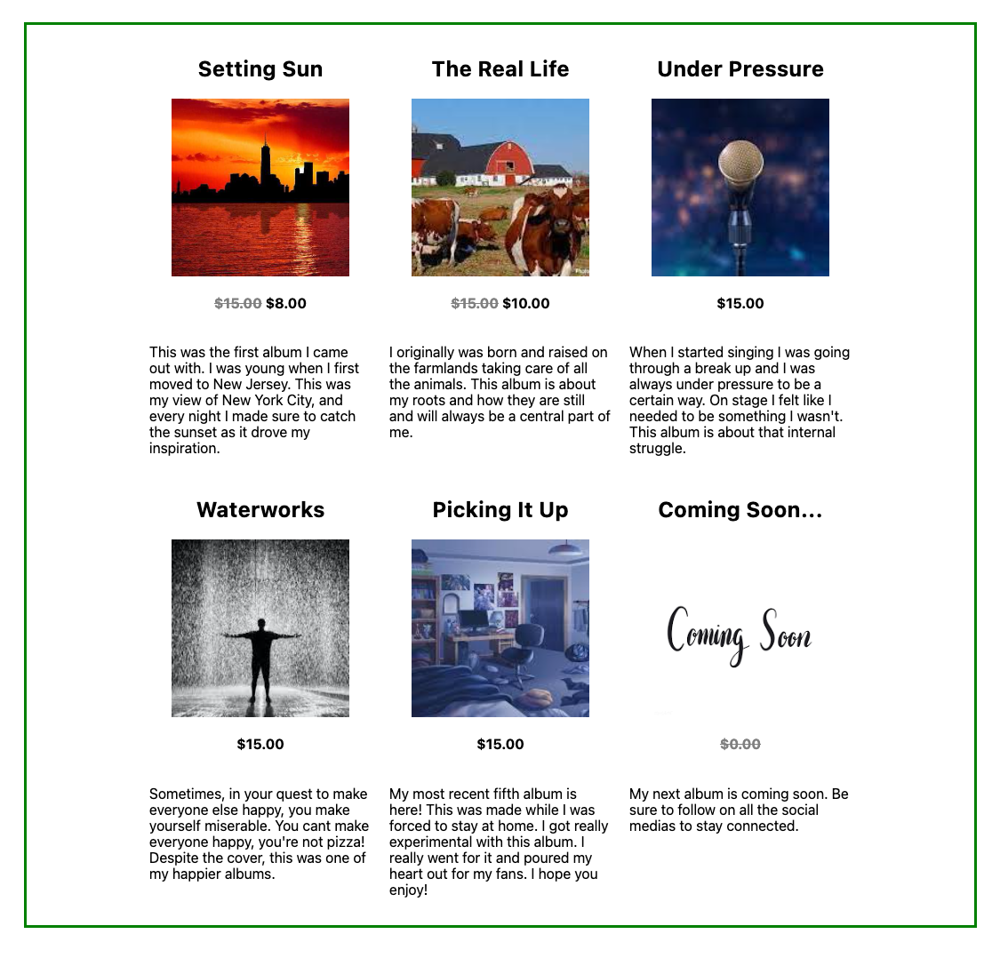
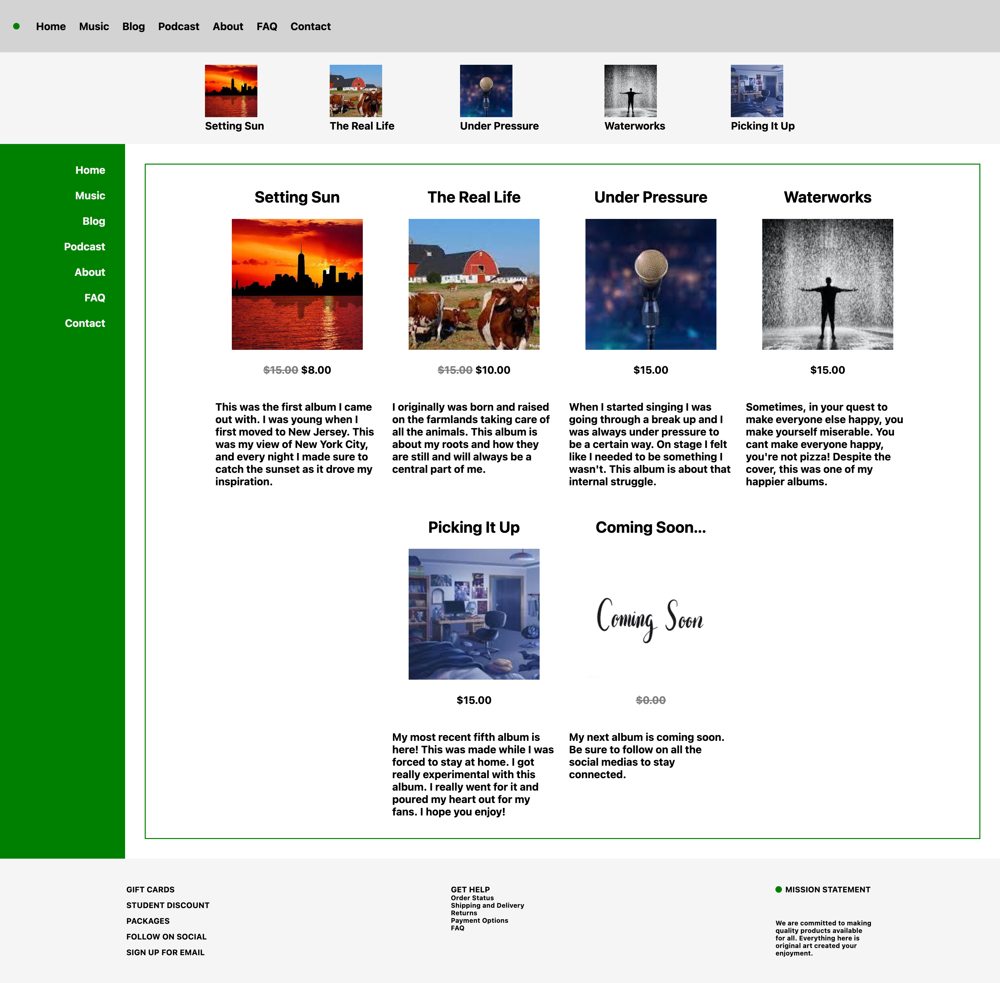

# Flexbox Interview

### Teacher Notes

This lab is a way for students to get some at bats at applying CSS Flexbox to pre-written HTML code. The main section focusses on tackling individual parts of a webpage such as the sidebar, footer, etc. In the extension, students will have two opportunities to use both Grid and Flexbox to bring these different parts together completing a full webpage. 

DISCLAIMER: The order of the two extension questions are interchangeable. #5 is slightly more challenging than #6 as it requires the cutting and pasting of code from various files into one. This can cause some errors that are good to troubleshoot through, but are not the intent of such a lesson. However, #5 is a natural continuation of the previous levels 1-4. 

### Prompt

You're applying for a different position, and this employer wants to see that you are proficient with using CSS Flexbox to style a webpage. The company is currently being hired to make a website for a musician. They've separated the task into separate parts to progressively test your competency before giving you the job.

**Directions**: Your task is to now use only Flexbox to style the CSS for each level matching the corresponding mock ups. [Use this resource](https://css-tricks.com/snippets/css/a-guide-to-flexbox/) to refer to for support throughout the different levels.

1. For this first layout, you'll want to use `flex-direction` and `align-items` to shift the sidebar items to the right side of the `div`. As always, don't forget to also include `display: flex;`.

    _Mock Up 1 - Sidebar_
    

2. Most websites have a navbar. This one has 2! In the first navbar you'll need to use `align-items`, and in the second, you'll need both `align-items` and `justify-content`. As always, don't forget to also include `display: flex;` in both rulesets. NOTE: the default `flex-direction` is `row`, so we don't need to specify it for these navbars.

    _Mock Up 2 - Navbars_
    

3. Things get a bit trickier for the footer here in level 3. There are 4 parts to this that will need adjusting.
    - First, `display: flex` and use `justify-content` in your footer to spread out the three sections of the footer.
    - Then, `display: flex` and use `flex-direction` for each column in the footer.
    - Next, `display: flex` and use `align-items` for each title class.
    - Last, find the IDs for, and create 2 new rulesets for the first and third item in the footer. Use `justify-content` to spread them apart. 

    _Mock Up 3 - Footer_
    

4. The last part of the webpage we'll modify is the main body containing the album cards which each have a title, an album cover, a price, and a description. 
    - For the whole container, use `justify-content` and `flex-wrap` to center the cards and allow them to go to a new line when minimizing the screen.
    - For each container item, use `flex-direction` and `align-items` to vertically center the contents of each card as depicted below.

    _Mock Up 4 - Full Page View_
    
    _Mock Up 4 - Minimized screen: "flex-wrap" in action_
    

### Culturally Responsive Best Practice

[COURTNEY TO ADD]

### Extra Help?

...

### Extensions

**Directions**:

5. Now that you've completed the individual parts of the website, it's time to put it all together into one site. Copy and paste the individual HTML levels 1-4 into the main `level_five.html`. Do the same with all the individual CSS code -- put it into the one `level_five.css`. The goal will be to use Grid to orient the page so that it looks like _"Mock Up 5"_ below. There are a couple of things you should _delete_ before doing this:
    - In the `.sidebar` ruleset, delete `width: 150px;` and
  `height: 100vh;`. You will replace this with grid.
    - In the `.footer` ruleset, delete `position: fixed;` and `width: 100%;`

    _Mock Up 5 - Full Page View_
      

6. Another client has a vision for a website. They have put all the information for the main page together in `level_six.html` along with some basic styling in `level_six.css`. Here you will need to use Grid **and** Flexbox to get the page in order. Line it up to the Mock Up design below.

    _Mock Up 6 - Full Page View_
    
    _Mock Up 6 - Minimized View_
    

**Reflection Questions:**

- How would you compare Grid with Flexbox? Which one do you like better? What situations make one better than the other? 
- ...

